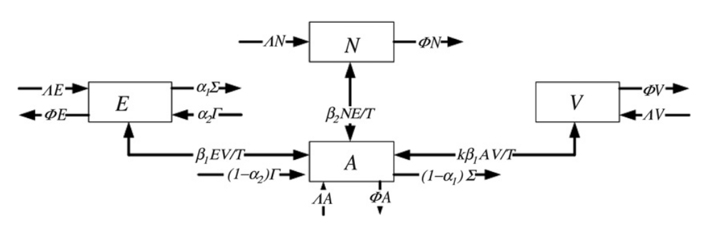

# A mathematical model of the pressure of an extreme ideology on a society

Based (very freely) on Santonja, Francisco J., Ana C. Tarazona, and Rafael J. Villanueva. "A mathematical model of the pressure of an extreme ideology on a society." Computers & Mathematics with Applications 56.3 (2008): 836-846.

## Groups of parties

- Group G1: Non-nationalist parties against independence and the use of violence;
- Group G2: Nationalist parties agreeing with independence but disagreeing with the use of violence;
- Group G3: Nationalist parties agreeing with independence and the use of violence.

## Subpopulations

- : Number of people who share the common ideological characteristics of parties in G1 at time t;
- : Number of people who share the common ideological characteristics of parties in G2 at time t;
- : Number of people who share the common ideological characteristics of parties in G3 at time t;
- : The rest of people at time t. It includes people who do not share the ideological characteristics of groups G1, G2 and G3 or people who abstain.

## Model

Lets consider a population subdivised into this 4 groups (E, N, V, A). Then, lets assume that:

- The number of births  and the number of deaths  are proportional to the number of individuals in each subpopulation;
- Terrorism does not increase substantially the number of deaths;
- The imigration  and the emigration  are included. It is considered that only occurs in subpopulations E and A due to the terror pressure in proportions  and , respectively.

Then, the system of equations that models the evolution of ideologies (under pressure of the violence) is given by:

-  0"> indicates that the transition is due the pressure of violent acts and  indicates a strict law enforcement;
-  0">;
- ;
- ;
- ;

- ;

- .
